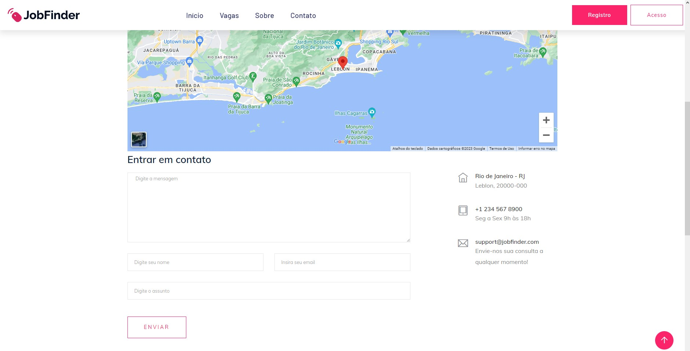
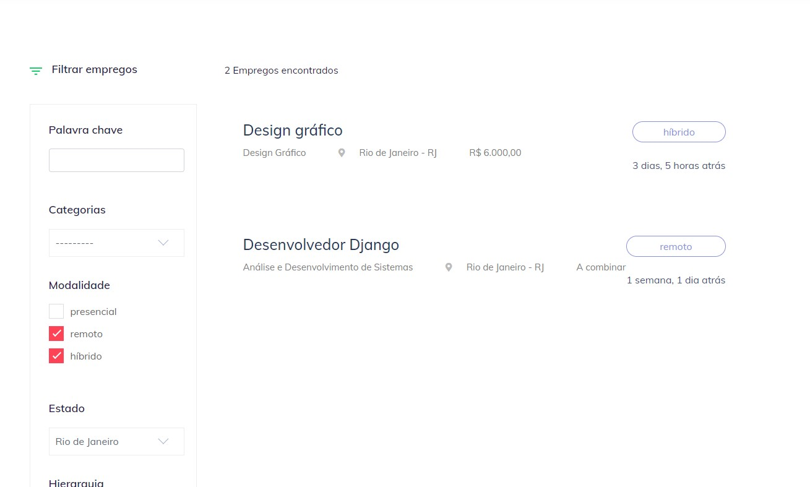
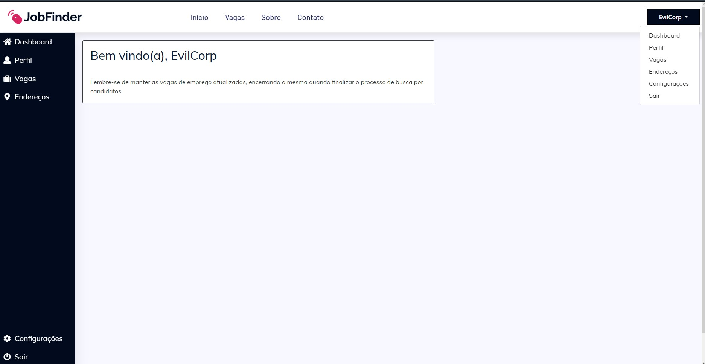
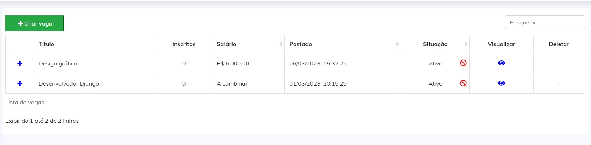
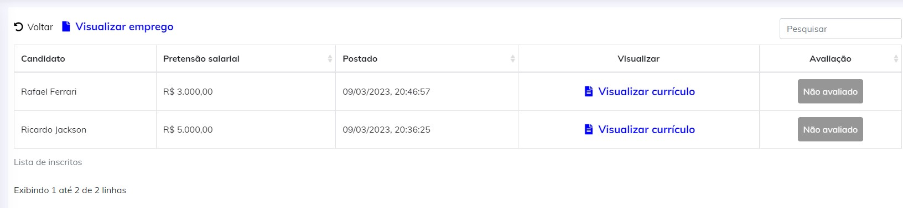
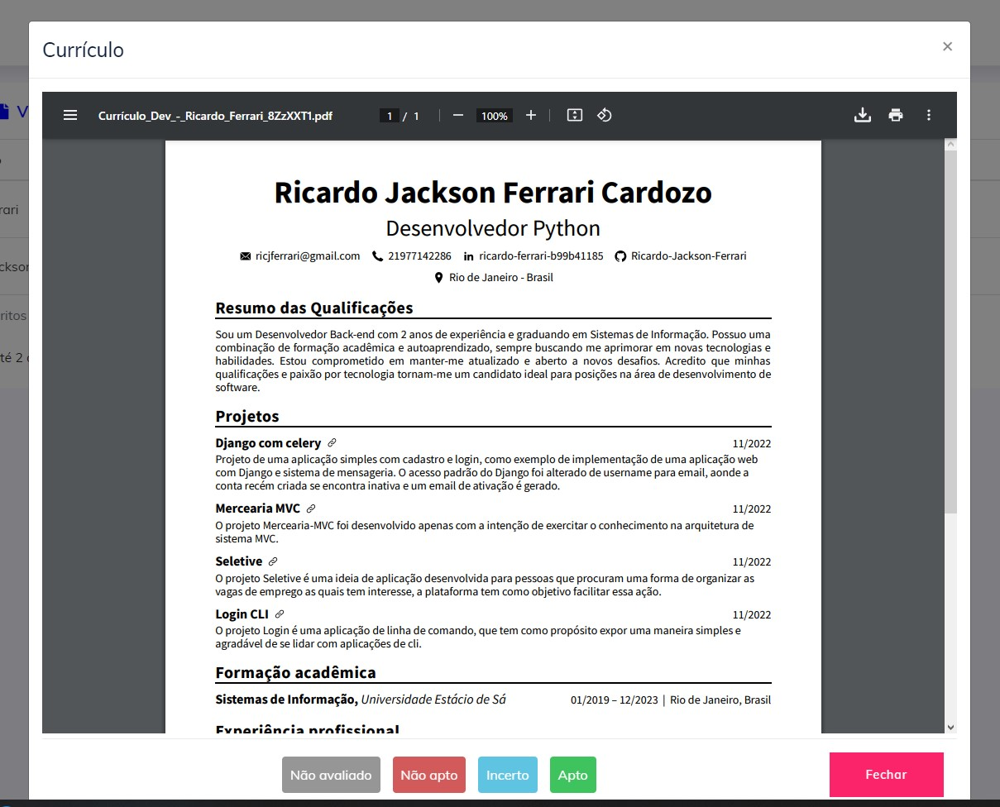
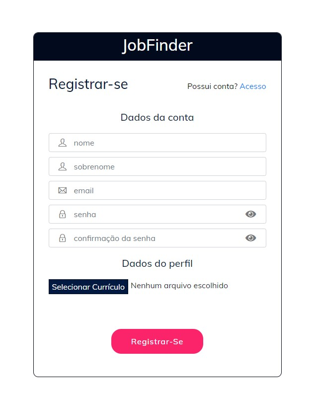
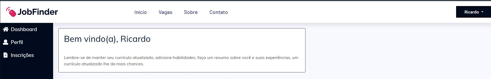
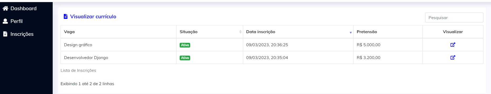

<p align="center">
  <a href="#-tecnologias">Tecnologias</a>&nbsp;&nbsp;&nbsp;|&nbsp;&nbsp;&nbsp;
  <a href="#-projeto">Projeto</a>&nbsp;&nbsp;&nbsp;|&nbsp;&nbsp;&nbsp;
  <a href="#-funcionalidades">Funcionalidades</a>&nbsp;&nbsp;&nbsp;|&nbsp;&nbsp;&nbsp;
  <a href="#-como-executar">Como executar</a>
</p>

<br>

<a id="-tecnologias"></a>

## ✨ Tecnologias

Esse projeto foi desenvolvido com as seguintes tecnologias:


<a id="-projeto"></a>

## 💻 Projeto

O JobFinder é um projeto de aplicação web desenvolvido com fins de aprendizado para meu portfólio pessoal. É um site de vagas que permite que candidatos e empresas se cadastrem, criem seus perfis e interajam entre si. Os candidatos podem registrar um currículo e se candidatar às vagas disponíveis, enquanto as empresas podem gerenciar suas vagas, gerenciar as inscrições com uma funcionalidade de avaliação pessoal para melhor triagem.

A aplicação oferece uma interface fácil de usar e intuitiva, com recursos úteis para a busca e gerenciamento de vagas. O site possui recursos de segurança, como autenticação e autorização, para proteger os dados dos usuários. Com este projeto, espero demonstrar minhas habilidades e conhecimentos em desenvolvimento web, bem como a capacidade de criar soluções práticas e funcionais.

<a id="-funcionalidades"></a>

## 🎯 Principais funcionalidades

- [x] Cadastro e login de candidatos e empresas
- [x] Recuperação de senha
- [x] Registro de currículo para candidatos
- [x] Gerenciamento de vagas para empresas
- [x] Avaliação de currículo por vaga com visualização apenas para empresa
- [x] Gerenciamento de perfil para empresas
- [x] Busca avançada de vagas

<p align="center">

  

</p>

<p align="center">

  

</p>

<p align="center">



</p>

<p align="center">

  

</p>

<p align="center">

  

</p>

<p align="center">

  

</p>

<p align="center">

  

</p>

<p align="center">

  

</p>

<p align="center">

  

</p>

<p align="center">

  

</p>


<p align="center">

  

</p>

Veja mais imagens [aqui](.github/media).

<a id="-como-executar"></a>

## 🚀 Como executar

### 💻 Pré-requisitos

Antes de começar, verifique se você atendeu aos seguintes requisitos:

- Você instalou a versão mais recente de `< Python >`

- Você tem uma máquina `< Windows / Linux / Mac >`.

- Você possui um `< Editor de código ou IDE >`.

- Você possui `< Git >`.

### 🛠️ Instalação

Faça o clone do projeto.

Link https
```bash
git clone https://github.com/Ricardo-Jackson-Ferrari/jobfinder.git
```

Link ssh
```bash
git clone git@github.com:Ricardo-Jackson-Ferrari/jobfinder.git
```

Após clonar o repositório acesse o diretório

```bash
cd jobfinder
```

Crie uma maquina virtual  para rodar o projeto.

```python
python -m venv .venv
```

Uma vez criado seu ambiente virtual, você deve ativá-lo.

No Unix ou no MacOS, executa:

```bash
source .venv/bin/activate
```

No Windows, execute:

```bash
.venv\Scripts\activate.bat
```

Com o ambiente virtual ativo instale as dependências

Com pip
```python
pip install -r requirements.dev.txt
```

Com pipenv
```python
pipenv install --dev
```

execute os comandos abaixo para criar arquivos de variáveis de ambiente a partir de exemplos. (Lembre-se de modificá-los)

```bash
cp env .env
cp env.prod .env.prod
```

### Execução de desenvolvimento sem docker

Na primeira vez é necessário executar esse comando para aplicar as migrações do banco de dados
```python
python manage.py migrate
```

Criando super usuário para acessar o painel administrativo
```python
python manage.py createsuperuser
```

Executando a aplicação
```python
python manage.py runserver
```

Agora você pode acessar [localhost:8000](http://localhost:8000) no seu navegador.

### Execução de produção com docker

Na primeira fazemos a coleta dos arquivos estáticos da aplicação
```python
python manage.py collectstatic
```

Depois basta executar
```bash
docker-compose up -V -d
```

Agora você pode acessar [localhost](http://localhost) no seu navegador.

Os emails enviados podem ser visualizados no link [localhost:8025](http://localhost:8025)

Para acessar o painel administrativo basta criar um super usuário com o seguinte comando

```bash
docker compose exec app python manage.py createsuperuser
```

Para poder parar a aplicação no docker basta executar
```bash
docker compose down
```